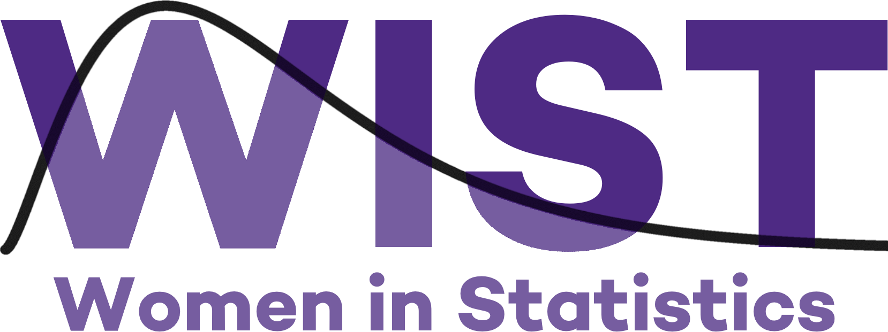
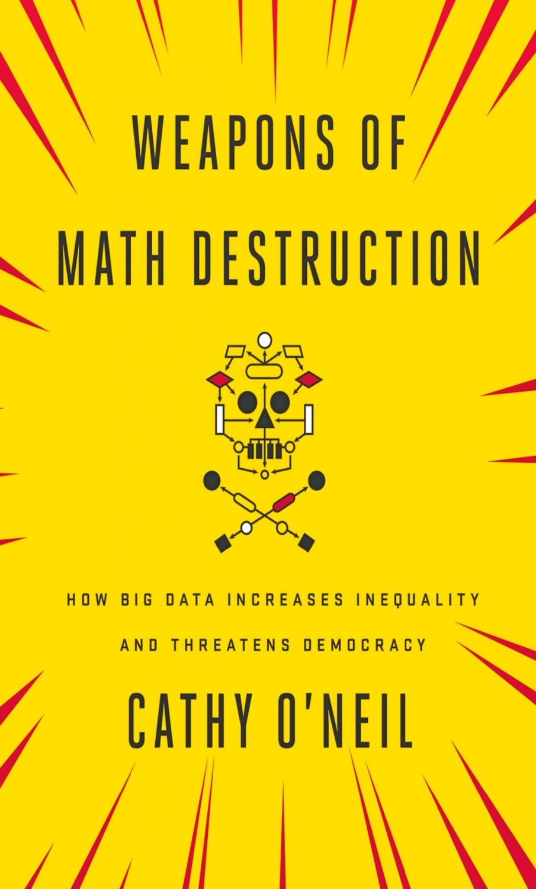

 

<h1> Discussion </h1> 
 <i> Stay connected with your statistics peers with this quarter-long book discussion! </i>    

This quarter WIST will be sponsoring a quarter-long book discussion.  Participants will read one or two chapters each week and then have a discussion.  Discussion sections will take place once a week on Friday's at 1:00pm CT using Zoom.  For spring quarter 2020, WIST will be reading Weapons of Math Destruction by Cathy O'Neil.  

<h1> Meeting Information </h1> 

<h2> Schedule </h2> 

Discussion Topic | Date | Time  
----|---|-------  
Introduction and Chapter 1 | Friday, April 10th | 1:00 - 1:30pm CT   
Chapter 2 | Friday, April 17th  | 1:00 - 1:30pm CT     
Chapter 3 | Friday, April 24th  | 1:00 - 1:30pm CT     
Chapter 4 | Friday, May 1st     | 1:00 - 1:30pm CT     
Chapter 5 | Friday, May 8th     | 1:00 - 1:30pm CT     
Chapter 6 | Friday, May 15th    | 1:00 - 1:30pm CT     
Chapter 7 | Friday, May 22nd    | 1:00 - 1:30pm CT     
Chapter 8 | Friday, May 29th    | 1:00 - 1:30pm CT     
Chapter 9 | Friday, June 5th    | 1:00 - 1:30pm CT    
Chapter 10 | Friday, June 12th* | 1:00 - 1:30pm CT     
Conclusion | Friday, June 19th* | 1:00 - 1:30pm CT     
  
*Finals Week and Summer Break, dates subject to change  

<h2> Link </h2> 
The Zoom link for the meeting will be emailed out to the WIST listserv the day before a given discussion.  

Please email Martha, <a href="mailto:mareichler@u.northwestern.edu"> mareichler@u.northwestern.edu</a>, if you have questions or need more information. 

<h1> Book </h1>  
  
 <b>Weapons of Math Destruction: How Big Data Increases Inequality and Threatens Democracy </b>   
 Cathy O'Neil  

<h2> Description from the Cover </h2> 

**A former Wall Street quant sounds an alarm on the mathematical models that pervade modern life and threaten to rip apart our social fabric.** 

We live in the age of the algorithm. Increasingly, the decisions that affect our lives—where we go to school, whether we get a car loan, how much we pay for health insurance—are being made not by humans, but by mathematical models. In theory, this should lead to greater fairness: Everyone is judged according to the same rules, and bias is eliminated.  

But as Cathy O’Neil reveals in this urgent and necessary book, the opposite is true. The models being used today are opaque, unregulated, and uncontestable, even when they’re wrong. Most troubling, they reinforce discrimination: If a poor student can’t get a loan because a lending model deems him too risky (by virtue of his zip code), he’s then cut off from the kind of education that could pull him out of poverty, and a vicious spiral ensues. Models are propping up the lucky and punishing the downtrodden, creating a “toxic cocktail for democracy.” Welcome to the dark side of Big Data.  

Tracing the arc of a person’s life, O’Neil exposes the black box models that shape our future, both as individuals and as a society. These “weapons of math destruction” score teachers and students, sort resumes, grant (or deny) loans, evaluate workers, target voters, set parole, and monitor our health.

O’Neil calls on modelers to take more responsibility for their algorithms and on policy makers to regulate their use. But in the end, it’s up to us to become more savvy about the models that govern our lives. This important book empowers us to ask the tough questions, uncover the truth, and demand change. 

<h2> Get the Book </h2> 

[Buy at Amazon](https://www.amazon.com/Weapons-Math-Destruction-Increases-Inequality/dp/0553418815)  
[Buy at thriftbooks](https://www.thriftbooks.com/w/weapons-of-math-destruction-how-big-data-increases-inequality-and-threatens-democracy_cathy-oneil/10762409/#isbn=0553418831&idiq=24418430)  
[Buy at Barnes & Nobel](https://www.barnesandnoble.com/w/weapons-of-math-destruction-cathy-oneil/1123130166?ean=9780553418835)  
[Borrow from the Chicago Library](https://chipublib.bibliocommons.com/item/show/1786498126)

<h1> Discussion Questions </h1>  

<h2> Introduction and Chapter 1 - April 10, 2020 </h2>  
1. WMD's are defined by opacity, scale and damage.  do you think these are appropirate qualifcations?  Show there be any others?  
2. O'Neil writes "Like gods, these mathematical models were opaque, their workings invisible to all but the highest priest in their domain: mathematicians and computer scientists."[^1] Do you think the comparison to religion is appropriate?  How as the role of mathmeticians and computer scientists in culture and society changed over the past decade?  
3.  Is there a way to change the incentive structure such that companies want to use data fairly?  WMDs survive because they offer a black-box scapegoat tool for boosting profits. The profits are a visible, measurable incentive.   So how do we advertise and measure the advantages of frequently-tested, feedback-driven, fair algorithms?  How will this affect statistical consulting firms (like Mathematica in O'Neil's example)? 

[^1]: O’Neil, Cathy. Weapons of Math Destruction: How Big Data Increases Inequality and Threatens Democracy. Penguin Books, 2018. (Introduction, Hardcover: p 3)

